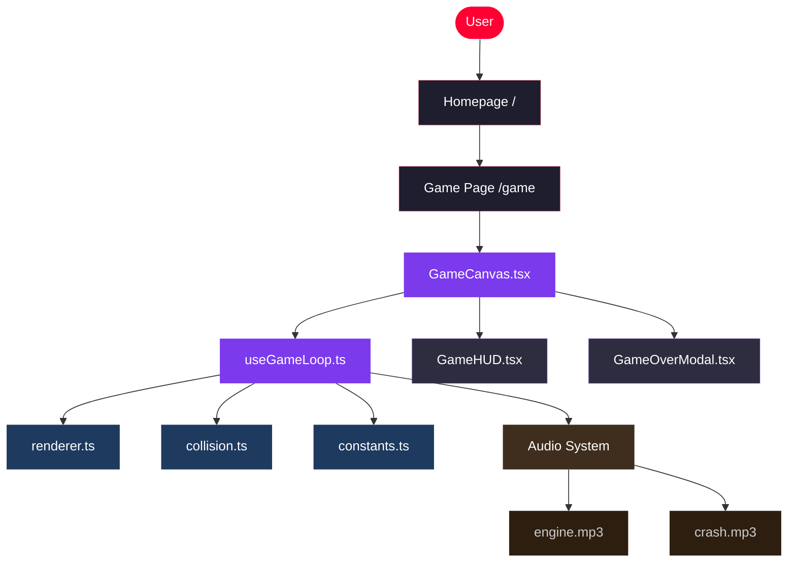

# ZA Racing

**Premium browser-based car racing game built by Zohair Azmat**

[](https://nextjs.org/)
[](https://www.typescriptlang.org/)
[](https://tailwindcss.com/)
[](https://developer.mozilla.org/en-US/docs/Web/API/Canvas_API)
[](#)
[](#)

> **Live Demo:** Coming soon &nbsp;|&nbsp; **Gameplay Demo:** Coming soon

---

## Overview

ZA Racing is a fully playable top-down arcade car racing game that runs entirely in the browser — no backend, no downloads, no dependencies beyond the browser itself.

Built to demonstrate real frontend engineering depth: a 60fps game loop, AABB collision detection, a scoring system, engine and crash sound effects, and a polished responsive UI — all structured with modern Next.js App Router and TypeScript.

---

## Why This Project Stands Out

Most portfolio projects are CRUD apps or static landing pages. ZA Racing is different:

| Capability | What It Demonstrates |
|---|---|
| 60fps game loop | `requestAnimationFrame` with ref-based state to avoid stale closures |
| Collision detection | AABB algorithm with 6px forgiveness padding |
| Sound system | HTML5 Audio triggered correctly from user gesture context |
| Score + high score | Session-persistent across runs without a database |
| Dynamic difficulty | Speed scales every frame; spawn interval tightens over time |
| Responsive canvas | Drawing buffer fixed at 480×720; CSS scales display to any screen |
| Premium UI | Glassmorphism HUD, animated hero preview, neon glow system |
| Clean architecture | Game loop, renderer, and collision each isolated in their own module |

---

## Features

- **Playable racing game** — fully interactive, not a demo
- **Smooth lane controls** — Arrow keys or A / D, immediate response
- **Dynamic difficulty** — speed and spawn rate increase as you survive
- **Live score** — increments every frame while running
- **Session high score** — persists across restarts without storage
- **Engine sound** — loops while running, triggered directly from click gesture
- **Crash sound** — fires once on collision, then game over
- **Glassmorphism HUD** — score, speed multiplier, best score in a blur-backed strip
- **Game over modal** — animated, shows score, best, new record badge
- **Premium dark UI** — red/purple neon accent system throughout
- **Fully responsive** — canvas scales cleanly on mobile without distortion

---

## Tech Stack

| Technology | Usage |
|---|---|
| **Next.js 16** | App Router, static pre-rendering, file-based routing |
| **TypeScript** | Full type coverage across game logic and UI |
| **Tailwind CSS v4** | Utility styling; pure CSS for custom button classes |
| **HTML5 Canvas** | All game rendering — road, cars, explosion, lane lines |
| **React Hooks** | `useRef` for 60fps state, `useState` for display values |
| **requestAnimationFrame** | Game loop with timestamp-based logic |
| **HTML5 Audio API** | Engine loop + crash one-shot, user-gesture safe |

---

## Architecture Overview



---

## Gameplay Flow

```
Player clicks "Start Engine"
  → engine.mp3 begins looping
  → game loop starts (requestAnimationFrame)
  → enemy cars spawn at increasing intervals
  → road lines scroll downward at current speed
  → score increments every frame
  → speed increases every frame

Player hits an enemy car
  → collision detected (AABB)
  → engine.mp3 stops
  → crash.mp3 fires once
  → explosion renders at collision point
  → game over modal appears with final score

Player clicks "Race Again"
  → state resets cleanly
  → engine.mp3 starts again from click gesture
  → new run begins
```

---

## Project Structure

```
zohair-racing-game/
├── app/
│   ├── globals.css          # Design tokens, button classes, keyframes
│   ├── layout.tsx           # Root layout, metadata, Open Graph
│   ├── page.tsx             # Homepage — hero, features, stack, CTA
│   └── game/
│       └── page.tsx         # Game page — renders GameCanvas
│
├── components/
│   ├── GameCanvas.tsx       # Main game container + overlays
│   ├── GameHUD.tsx          # Score / speed / best glassmorphism strip
│   ├── GameOverModal.tsx    # Animated game over screen
│   └── Navbar.tsx           # Fixed nav with SVG logo
│
├── lib/
│   ├── constants.ts         # All tuning values (speed, size, intervals)
│   ├── types.ts             # Car, GameState, GameStatus interfaces
│   └── game/
│       ├── useGameLoop.ts   # Core game hook — RAF loop, input, audio
│       ├── renderer.ts      # All canvas draw functions
│       └── collision.ts     # AABB collision detection
│
├── public/
│   └── sounds/
│       ├── engine.mp3       # Engine loop sound
│       └── crash.mp3        # Collision sound effect
│
├── context/                 # Branding notes and design decisions
├── docs/                    # Technical documentation
└── specs/                   # Prompt history and project specs
```

---

## Local Setup

```bash
# Clone the repository
git clone https://github.com/zohair-azmat-ai/Zohair-Racing-Portfolio.git
cd Zohair-Racing-Portfolio

# Install dependencies
npm install

# Start development server
npm run dev
```

Open [http://localhost:3000](http://localhost:3000) in your browser.

---

## Available Routes

| Route | Description |
|---|---|
| `/` | Homepage — project overview, features, tech stack, CTA |
| `/game` | Playable game — full canvas racing experience |

Both routes are statically pre-rendered — no server runtime required.

---

## Future Improvements

- [ ] Mobile touch controls (swipe left / right)
- [ ] Global leaderboard (Supabase or PlanetScale)
- [ ] Background music with toggle
- [ ] Multiple difficulty modes (Easy / Normal / Insane)
- [ ] Power-ups (shield, slow time)
- [ ] SVG branding pack and custom car skins
- [ ] Share score to Twitter / X

---

## Author

**Zohair Azmat** — Frontend Engineer

Built as a portfolio-grade project to demonstrate modern frontend engineering: game loop architecture, canvas rendering, sound system design, and premium UI — all in the browser.

---

*Built with Next.js · TypeScript · Tailwind CSS · HTML5 Canvas*
